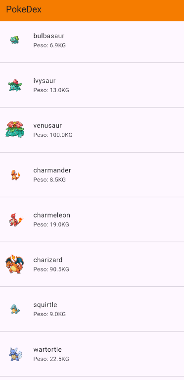
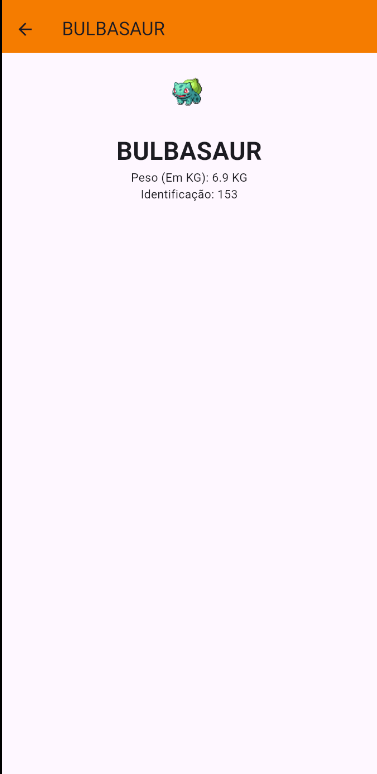

# PokeDex

Aplicativo desenvolvido em Flutter para a Disciplina de Tópicos Avançados de Programação, do professor Andrey Alencar Quadros!

## Ferramentas 🛠

- **Dart**
- **Flutter**
- **Dio**
- **GetX**
- **PokeApi**

## Prints

## Desenvolvedor

Desenvolvido por **Pedro Sawczuk** - **2022105100002**